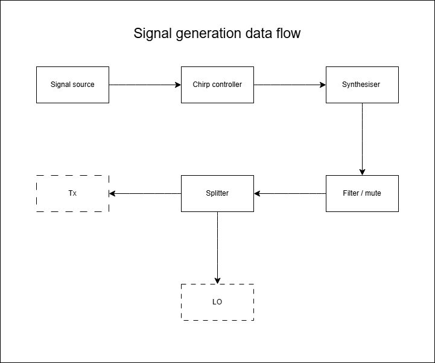

### Signal Generation

#### 1. Purpose
Generates the 2.4 GHz frequency sweep used for radar transmission.  
Provides a stable, repeatable chirp fully contained within the ISM band for reliable range measurements.

#### 2. Requirements
- Operates only within **2.400–2.4835 GHz** ISM band.  
- Sweep width up to **80 MHz**.  
- Output power **0 – +10 dBm** into **50 Ω**.  
- Chirp time adjustable **1 – 10 ms**.  
- Start marker jitter **< 1 µs** for timing sync.  
- Stable frequency reference (**a few ppm**) to maintain consistent range readings.  
- All emissions remain inside the ISM band and **below 100 mW EIRP**.

#### 3. Functional Overview / Data Flow

#### 5. Specifications
- Frequency reference: Either a separate 25 MHz TCXO (±1–2 ppm) or a synthesizer module that includes its own TCXO.
- Chirp controller: Digilent Cora Z7 (Zynq-7000).
- Synthesizer: Standard ADF4351 35 MHz–4.4 GHz development module.
- Attenuator: RF SMA attenuator 6 dB DC–3 GHz.
- Frequency filter: 2400–2500 MHz SMA band-pass filter.
- Mute: Initialy use synthesizer / controller mute.
- Splitter: 2-way 50 Ω SMA power divider, rated for 1–3 GHz (Wilkinson type).

#### 8. References
